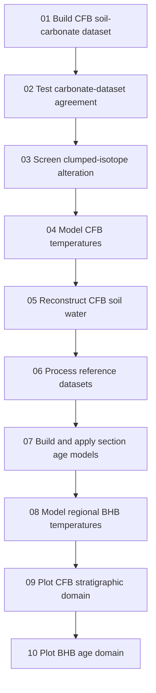

# Bighorn Basin Paleogene Proxies

## Data pipeline, chronostratigraphic framework, and interpretive guide

This document records the scientific and computational framework
developed for the `bighorn_paleogene_proxies` project. It is intended to
function as:

-   a guide to the production R pipeline;
-   a data-model specification;
-   a record of decisions about sections, correlations, and age models;
-   an explanation of the proxy-temperature and soil-water
    interpretations;
-   a roadmap for downstream plotting, statistical analysis, and
    publication.

It is not a verbatim transcript of project discussions. It consolidates
the resulting decisions, reasoning, caveats, and implemented procedures.

------------------------------------------------------------------------

## 1. The central objective

The project should make it possible to select any included proxy
observation and determine:

1.  what was measured;
2.  which sample and horizon it represents;
3.  which measured stratigraphic section it came from;
4.  its native stratigraphic position;
5.  which section-specific age model was used;
6.  its estimated numerical age on the adopted GTS2020-based framework;
7.  the uncertainty or chronology-support information associated with
    that estimate;
8.  what environmental quantity the proxy can reasonably be interpreted
    to represent.

The governing principle is that proxy observations, stratigraphic
positions, and numerical-age priors are different kinds of information.
They must remain separable and auditable even after they are joined into
plotting tables.

------------------------------------------------------------------------

## 2. Core scientific decisions

### 2.1 CFB is the primary internally integrated soil-carbonate record

The main soil-carbonate compilation is restricted to the Clarks Fork
Basin composite (`section_id == "CFB"`). It combines the compatible CFB
portions of:

-   IPL measurements;
-   Colorado University measurements;
-   Snell et al. measurements;
-   Koch et al. carbonate isotope data;
-   Bowen et al. carbonate isotope data.

This product is named `CFB_soilcarb_isotope_summary`, not a generic
`BHB_multiproxy` table. The name makes its geographic and proxy scope
explicit.

All IPL, CU, and Bowen observations are treated as CFB. Snell and Koch
contain observations from more than one section, so their complete
cleaned summaries are preserved before filtering. Their non-CFB data
remain available as regional reference records.

### 2.2 Do not force all BHB sections onto a shared meter scale

Stratigraphic height is meaningful only within its native measured
section or an explicitly established composite. The same numerical meter
value in CFB, MCP, Elk Creek, or Sand Creek Divide does not represent
the same horizon.

The column `section_id` is therefore mandatory wherever `strat_height_m`
appears. A unique stratigraphic identity is at minimum:

``` text
section_id + strat_height_m
```

and a unique sample/horizon identity normally also includes
`MLA_horizon_id` or the source sample identifier.

### 2.3 Build age models by section, not by a broad "SBHB" grouping

The early idea of three broad composites---CFB, MCP, and SBHB---was
replaced by section-specific modeling. Sedimentation rates and local
stratigraphic architectures can vary enough that a single southern-BHB
meter-to-age model would create false precision.

CFB and MCP remain useful composites because established literature
frameworks already support those scales. Other measured sections should
receive their own models when adequate absolute control exists.

### 2.4 Use one downstream age field, while retaining all provenance

`Age_Ma` is the standard numerical-age field used downstream. It is
populated from the age model corresponding to each row's `section_id`
and native `strat_height_m`.

This simplifies plotting and analysis, but it does not replace the
supporting fields. Every age-calibrated record should retain:

-   `section_id`;
-   `strat_height_m`;
-   `Age_Ma`;
-   `age_model_id`;
-   `age_model_position`;
-   distance or support diagnostics where available.

### 2.5 Keep environmental temperature quantities separate

The project distinguishes:

-   **MAT**: mean annual air temperature, modeled from leaf-margin
    analysis;
-   **T47**: carbonate clumped-isotope formation temperature, commonly
    biased toward warm-season soil conditions in pedogenic carbonate;
-   **CMMT**: cold-month mean temperature;
-   **WMMT**: warm-month mean temperature;
-   **MART**: mean annual range in temperature, normally `WMMT - CMMT`.

MAT and T47 must not be combined into a single fitted temperature curve.
They are plotted in parallel because their divergence contains
information about seasonality, proxy formation, and local environment.

------------------------------------------------------------------------

## 3. Production pipeline

The full production workflow is run by:

``` r
source(here::here("scripts", "master_run_BHB_pipeline.R"))
```

The current dependency order is:



The production scripts are:

| Order | Script                                 | Primary role                                                               |
|----------------------------:|----------------------|----------------------|
|     1 | `01_build_CFB_soilcarb_dataset.R`      | Clean source datasets and build the authoritative CFB soil-carbonate table |
|     2 | `02_analyze_CFB_carbonate_agreement.R` | Evaluate inter-dataset carbonate-isotope agreement                         |
|     3 | `03_screen_CFB_clumped_diagenesis.R`   | Generate alteration flags and cumulative screening scenarios               |
|     4 | `04_model_CFB_temperatures.R`          | Fit scenario-specific CFB T47 models and select the production scenario    |
|     5 | `05_reconstruct_CFB_soilwater.R`       | Reconstruct δ18O and Δ′17O of soil water using Monte Carlo propagation     |
|     6 | `06_process_reference_datasets.R`      | Clean and export regional/global reference records and insolation          |
|     7 | `07_build_and_apply_BHB_age_models.R`  | Build section-specific age models and assign `Age_Ma`                      |
|     8 | `08_model_BHB_temperatures.R`          | Build separate BHB LMA MAT and all-BHB T47 time models                     |
|    8b | `08b_synthesize_BHB_seasonal_climate.R` | Build cited MAAT, CMMT, WMMT, and MART evidence ensembles and orbital diagnostics |
|     9 | `09_plot_CFB_strat_domain.R`           | Plot the primary CFB record in native stratigraphic space                  |
|    10 | `10_plot_BHB_age_domain.R`             | Plot CFB and regional reference data in numerical-age space                |

`scripts/10_other_plots.R` remains outside the numbered production
sequence and should be treated as an auxiliary or exploratory plotting
script unless it is explicitly refactored into the main workflow.

------------------------------------------------------------------------

## 4. Script-by-script methods and data contracts

### 4.1 Script 01: build the CFB soil-carbonate dataset

**Purpose**

Clean and summarize source datasets, preserve source-specific variables,
and assemble the primary CFB soil-carbonate compilation.

**Important behavior**

-   Complete Snell and Koch summaries are created before geographic
    filtering.
-   Rows with `section_id != "CFB"` are excluded from the integrated CFB
    table, not deleted from the project.
-   Source-specific columns remain visibly named. This prevents
    accidental use of a generic carbonate value without knowing whether
    it came from IPL, CU, Snell, Koch, or Bowen.
-   `MLA_horizon_id` is the principal cross-dataset horizon key.
-   `strat_height_m` remains the native CFB composite position for the
    integrated table.

**Primary output**

``` text
data/processed/CFB_soilcarb_isotope_summary.csv
```

**Regional-reference outputs**

``` text
data/processed/SnellEtAl2013_soilcarb_summary.csv
data/processed/Koch_soilcarb_summary.csv
```

These retain MCP or other non-CFB observations for subsequent age
modeling and comparison.

### 4.2 Script 02: carbonate agreement analysis

This analysis occurs immediately after dataset construction because
agreement among carbonate datasets affects all later choices about
pooled values, temperature pairing, and soil-water reconstruction.

The script:

-   identifies horizons represented by multiple datasets;
-   compares δ18Ocarbonate estimates;
-   summarizes agreement and disagreement;
-   exposes large discrepancies rather than silently averaging them.

Agreement analysis is a diagnostic. It should inform data selection and
uncertainty interpretation, not automatically delete observations.

### 4.3 Script 03: diagenetic screening

Diagenetic screening is part of the production pipeline because
alteration decisions affect the temperature model that feeds the
soil-water calculation.

The script creates reproducible horizon-level flags and four cumulative
scenarios:

1.  all data;
2.  exclude high alteration likelihood;
3.  exclude moderate or higher alteration likelihood;
4.  exclude any alteration indication.

It retains paired Δ47--Δ48 information and supporting isotope-space
plots. Screening flags are data products; the screening script does not
itself decide which scenario becomes the production temperature model.

### 4.4 Script 04: CFB temperature modeling

The temperature script fits a separate model for every screening
scenario and plots them together with uncertainty ribbons. This
preserves the sensitivity of the inferred temperature history to the
alteration decision.

The current production setting is:

``` r
primary_screening_scenario <- "exclude_moderate_or_higher"
```

Changing that single setting changes which scenario supplies the
production `T_model_*` columns used for soil-water reconstruction. The
other scenario models remain available for comparison.

#### Combining co-located temperature measurements

When more than one source provides T47 at the same horizon, estimates
are combined using inverse-variance weights:

``` text
weight = 1 / SE²
weighted mean = Σ(T × weight) / Σ(weight)
combined analytical SE = sqrt(1 / Σ(weight))
```

This is appropriate only under a fixed-effect assumption: the
measurements are treated as estimates of one underlying horizon
temperature, and the reported analytical standard errors describe their
relative precision.

The combined SE does **not** capture:

-   calibration systematics;
-   interlaboratory offsets;
-   differences in analyzed carbonate material;
-   unresolved diagenesis;
-   seasonal or microsite variability.

#### Smoothing and prediction

-   Co-located estimates are first combined by horizon.
-   A short rolling average stabilizes local anchors.
-   A smoothing spline is fit in CFB stratigraphic space.
-   Local uncertainty incorporates nearby analytical uncertainty and
    residual model mismatch.
-   Predictions outside the observed temperature range are set to `NA`.

The "no extrapolation" rule is important. A smooth curve should not
imply a temperature history where no clumped-isotope observations exist.

### 4.5 Script 05: soil-water reconstruction

The CFB temperature model and selected carbonate δ18O and Δ′17O
measurements are combined using Monte Carlo propagation.

#### δ18Owater

Each Monte Carlo draw samples the relevant carbonate and temperature
uncertainties, then applies the chosen calcite--water fractionation
relationship to reconstruct soil-water δ18O.

#### Δ′17Owater

The corrected implementation samples measured carbonate Δ′17O directly.
It does **not** independently sample δ17O and δ18O and then recompute
their tiny difference. Independent sampling of the large parent isotope
values destroys their covariance and produces unrealistically enormous
Δ′17O confidence intervals.

The resulting Δ′17Owater intervals represent propagated analytical and
temperature uncertainty under the specified equilibrium model. They do
not include every possible source of natural or model uncertainty.

### 4.6 Script 06: reference datasets

Reference datasets are processed separately from the primary CFB
soil-carbonate record. This prevents the internal analytical dataset
from becoming an uncontrolled basin-wide mixture.

Current reference products include:

-   Harper et al. marine SST and atmospheric CO2;
-   Kelson et al. Tornillo Basin clumped-isotope data;
-   Fricke et al. mammal and gar apatite isotope records;
-   Wing et al. leaf-margin MAT estimates;
-   Fricke and Wing BHB MAAT estimates;
-   the ZB20a orbital solution and calculated 47°N summer-solstice
    insolation;
-   complete summarized Snell and Koch regional soil-carbonate datasets.

Reference products are saved as processed CSV files so plotting scripts
do not re-clean raw literature tables independently.

### 4.7 Script 07: section-specific age models

This script separates three data types:

1.  **section chronostratigraphy**: where an event occurs in a measured
    section;
2.  **absolute-age priors**: the adopted numerical age of a transferable
    event;
3.  **proxy data**: observations to which the resulting age model is
    applied.

Proxy values never determine the age model.

#### Chronostratigraphic workbook

``` text
data/excel files/BHB_section_chronostratigraphy.xlsx
```

The workbook records section events, native positions, position ranges,
confidence, citations, and source figure/table locators. It is the
auditable location for literature-derived stratigraphic correlations.

#### Absolute-age priors

``` text
data/raw/absolute_age_priors.csv
```

This table stores the transferable ages used across sections, including:

-   GTS2020 magnetochron boundaries;
-   the project datum for base Wa0 / PETM onset at 55.900 Ma;
-   dated ash or zircon ages where appropriate.

Section-specific radiometric ages remain tied to their section event
rather than being generalized unnecessarily.

#### Deterministic age model

For each eligible `section_id`:

-   tie points are sorted by native stratigraphic position;
-   age order must be monotonic;
-   ages are linearly interpolated between adjacent tie points;
-   the model may linearly extrapolate beyond the outermost tie points
    where the implemented section predictor allows it;
-   interpolation and extrapolation status are recorded explicitly.

Extrapolated ages should be treated more cautiously than interpolated
ages and should remain visibly identifiable in downstream analysis.

#### The Belt Ash conflict

The published Belt Ash age is retained in the audit table with its
uncertainty, but its central value is excluded from the deterministic
CFB model because it creates a local reversal relative to the adopted
GTS2020 base-C26n age. This is an example of preserving conflicting
evidence without forcing an internally inconsistent deterministic curve.

#### Chronology-support metric

`distance_to_nearest_prior_m` measures stratigraphic distance to the
nearest dated tie point. `age_control_distance_index` scales this
concept for plotting.

These are **not formal age uncertainties**. They indicate relative
chronology support: darker plotting can represent closer control and
lighter plotting can represent greater distance. A formal age posterior
would additionally require uncertainty in event positions, event
correlations, absolute ages, and the age--depth model itself.

### 4.8 Script 08: integrated regional temperature models

Two independent time models are built.

#### BHB LMA MAT model

The MAT model uses the eight aggregate Wing et al. leaf-margin
estimates.

For each Monte Carlo realization:

-   MAT is sampled from its reported temperature uncertainty;
-   age is sampled uniformly within the published aggregate age
    interval;
-   a moderately smooth spline is fitted;
-   predictions are retained only within that realization's sampled age
    range.

The final curve is an interpolated regional LMA trajectory. It is not a
high-resolution annual-temperature history. Wing samples pool floras
across time and, in some cases, across multiple sections.

#### All-BHB T47 formation-temperature model

This model uses all currently age-resolved BHB pedogenic carbonate T47
data:

-   56 CFB observations;
-   4 MCP observations.

Observations are grouped into 0.10 Myr bins before smoothing. Within
each bin, temperatures are combined by inverse-variance weighting.
Binning prevents the dense PETM sampling from dominating the regional
curve simply because many more samples were collected there.

Monte Carlo simulations propagate reported temperature SE at fixed
estimated ages. Current intervals do not propagate age-model uncertainty
or an explicit uncertainty in the seasonal meaning of soil-carbonate
formation.

The model does not extrapolate beyond its oldest and youngest
observations.

#### Why the two curves remain separate

LMA estimates mean annual air temperature. Pedogenic carbonate T47
generally records soil temperature during carbonate formation, which is
often biased toward the warm and/or dry season. The difference between
them can inform seasonality, but subtracting the curves mechanically
does not automatically produce a formal MART reconstruction because:

-   their sampling ages and temporal resolutions differ;
-   soil temperature is not identical to air WMMT;
-   carbonate formation season can vary with moisture and depth;
-   both proxies have method-specific biases.

### 4.9 Scripts 09 and 10: stratigraphic- and age-domain plots

The project deliberately preserves both views.

**Stratigraphic-domain plots** are best for:

-   seeing raw sampling density;
-   evaluating relationships with lithostratigraphy;
-   assessing the placement of the PETM CIE in a native section;
-   detecting whether apparent temporal patterns are artifacts of the
    age model.

**Age-domain plots** are best for:

-   comparing different sections;
-   aligning proxy records with marine temperature, CO2, and insolation;
-   examining leads, lags, and event-scale relationships;
-   constructing publication multipanels on a common GTS2020-based axis.

Both should be retained. Numerical age should not erase the original
stratigraphic coordinate.

------------------------------------------------------------------------

## 5. Section framework

The controlled `section_id` vocabulary includes:

| `section_id`        | Section or composite                        | Current role                                                     |
|------------------------|------------------------|------------------------|
| `CFB`               | Clarks Fork Basin / Polecat Bench composite | Primary soil-carbonate record; active age model                  |
| `MCP`               | McCullough Peaks composite                  | Regional soil-carbonate reference; active age model              |
| `CABIN_FORK`        | Cabin Fork                                  | Independent southeastern section                                 |
| `HWY16`             | Highway 16                                  | Independent southeastern PETM section                            |
| `CAB10`             | CAB 10                                      | Native measured section; correlations retained explicitly        |
| `CAB3`              | CAB 3                                       | Native measured section; correlations retained explicitly        |
| `BIG_RED_SPIT`      | Big Red Spit                                | Native measured section                                          |
| `PYRAMID_POINT`     | Pyramid Point                               | Native measured section; possible equivalence must be documented |
| `NORTH_BUTTE`       | North Butte                                 | Native measured section                                          |
| `HONEYCOMBS`        | Honeycombs                                  | Native measured section; revised CIE placement matters           |
| `ELK_CREEK`         | Elk Creek                                   | Important for Wing LMA; active where sufficient control exists   |
| `ANTELOPE_CREEK`    | Antelope Creek                              | Correlation support for Elk Creek framework                      |
| `SAND_CREEK_DIVIDE` | Sand Creek Divide                           | Independent southern section with local magnetostratigraphy      |
| `WORLAND_EAST`      | Worland East                                | Contributes to pooled floral records; model may remain deferred  |
| `FOSTER_GULCH`      | Foster Gulch                                | Central-BHB older Paleocene control                              |
| `BEAR_CREEK`        | Bear Creek                                  | Contributes to pooled Wing LMA samples                           |
| `MULTI_SECTION`     | Aggregate of multiple sections              | Published interval treatment, not a native meter scale           |

Section-model eligibility changes as chronostratigraphic events are
added. The model-status output, not this prose table, is authoritative
for the current run:

``` text
data/processed/BHB_section_age_model_status.csv
```

------------------------------------------------------------------------

## 6. Stratigraphic correlation philosophy

### 6.1 Transfer events, not arbitrary offsets

Sections should be related through documented events such as:

-   magnetochron boundaries;
-   dated ashes;
-   the PETM carbon isotope excursion onset;
-   physically traced geosols or beds;
-   mammalian biozone boundaries;
-   other clearly identified chemostratigraphic or biostratigraphic
    markers.

A correlation event should record both the scientific basis and its
location in the source publication. Figure and table identifiers are
essential because many positions were visually estimated from published
stratigraphic columns.

### 6.2 Biozones are useful but carry correlation uncertainty

The Koch, Bown, Clyde, Secord, Wing, Kraus, and related frameworks use
different combinations of mammalian biostratigraphy,
magnetostratigraphy, chemostratigraphy, and physical tracing. Biozones
can connect discontinuous sections, but their boundaries should not be
treated as perfectly synchronous or precisely located unless the
evidence warrants it.

The spreadsheet can retain biozone correlations without assigning them a
numerical age. Absolute ages should be assigned only where the project
has an adopted numerical prior.

### 6.3 Koch and Clyde meter scales are not automatically interchangeable

Koch et al. (2003) and Clyde studies may use different measured
sections, composite construction, or stratigraphic datums. A shared
fossil zone or magnetochron does not prove that their meter coordinates
differ by a constant offset. The correct procedure is to compile
homologous events in both scales and derive an explicit transformation
only if the event relationships support one.

### 6.4 Wing aggregate samples require interval-aware ages

Wing leaf-margin samples pool fossil floras across stratigraphic ranges
and sometimes across sections. Their age uncertainty is therefore not
just an analytical error around one horizon.

The current MAT model treats each published duration as an interval and
samples age uniformly across it. Future work could improve this by
reconstructing the component localities and their section-specific
positions, but should not replace the published aggregate interval with
a falsely precise point.

------------------------------------------------------------------------

## 7. Interpreting soil-carbonate temperatures

### 7.1 T47 is a formation temperature

Pedogenic carbonate clumped-isotope temperature should first be
described as carbonate formation temperature. Its environmental meaning
depends on:

-   soil depth;
-   season of carbonate growth;
-   soil moisture and evaporation;
-   vegetation and shading;
-   surface radiative heating;
-   burial and recrystallization;
-   carbonate material selected for analysis.

### 7.2 Warm-season interpretation

The development from early soil-carbonate applications through Kelson
and other later work supports treating well-screened pedogenic micrite
as a warm-season soil-temperature proxy in many semi-arid settings,
rather than as direct MAT. Carbonate commonly precipitates when soils
are warm and drying.

This interpretation is strongest when:

-   nodules come from sufficiently deep soil horizons;
-   pedogenic micrite is isolated from spar or visibly altered material;
-   petrographic and Δ47--Δ48 screening do not indicate alteration;
-   the result is evaluated against independent MAT or seasonal proxies.

### 7.3 Radiative heating and depth

Very shallow soils can be substantially hotter than the overlying air
because of direct solar and longwave radiative heating. Nodules from
depths greater than approximately 30 cm are less vulnerable to the most
extreme surface radiative effect, but depth alone does not make a
measurement equivalent to air temperature.

The pipeline should retain reported paleosol depth where available. A
depth screen can be evaluated as a sensitivity scenario rather than used
to silently remove measurements.

### 7.4 Diagenesis versus primary seasonal warmth

High temperatures are not automatically altered, and low temperatures
are not automatically primary. Interpretation should jointly consider:

-   petrography and carbonate material;
-   Δ47 and Δ48 behavior;
-   δ18Ocarbonate position in isotope space;
-   spar--micrite relationships;
-   burial-fluid trajectory simulations;
-   agreement among replicate analyses and laboratories;
-   stratigraphic coherence.

The project retains scenario models precisely because a single binary
screen can conceal how much the inferred history depends on the
alteration decision.

------------------------------------------------------------------------

## 8. Model--proxy comparison framework

### 8.1 Sewall and Sloan regional model

The Sewall and Sloan regional simulations provide BHB-specific model
benchmarks for MAT, cold-month temperature, and annual temperature
range. They are useful for evaluating whether the proxy values fall
within the modeled continental-interior seasonal climate.

They should not be treated as an independent numerical-age model. In
Snell et al., agreement with the regional climate simulation serves as
an independent climatological plausibility check on the high T47 values,
not as independent stratigraphic or geochronologic validation.

### 8.2 Huber and Caballero (2011)

Huber and Caballero showed that sufficiently strong greenhouse forcing
in CCSM3 can broadly reproduce early Eocene terrestrial MAT and CMMT,
improving substantially on older low-CO2 simulations. Their work weakens
the claim that models inevitably and uniformly underpredict all
greenhouse proxy temperatures.

The appropriate conclusion is conditional:

-   older or weakly forced models often produced continental
    temperatures below proxy estimates;
-   newer or more strongly forced simulations can match MAT and winter
    warmth much better;
-   substantial local and seasonal discrepancies can remain;
-   model--data comparison must use the same temperature quantity and a
    defensible paleolocation.

### 8.3 Hyland et al. regional seasonality benchmarks

Hyland et al. (2018) provide nearby Green River Basin RegCM3 monthly
temperatures under LoCO and HiCO scenarios. From the monthly values, the
project calculates MAT, CMMT, WMMT, and MART.

These values are equilibrium climate-state benchmarks. They are indexed
by model configuration and CO2, not assigned to precise sample ages.

### 8.4 Burgener et al. interpretive contribution

Burgener et al. emphasize that land cover and proxy-formation
environment can produce genuine local variation in MART. Paleobotanical
and geochemical proxies may differ partly because they sample different
microenvironments, not simply because one method or the climate model is
wrong.

This supports the project's choice to:

-   preserve proxy identity;
-   avoid converting T47 directly into MAT;
-   avoid assuming one basin-wide seasonal cycle;
-   interpret model--proxy differences in environmental context.

### 8.5 DeepMIP

DeepMIP offers a modern multi-model EECO ensemble and is an excellent
future comparison source. Monthly near-surface air temperature can
provide:

``` text
MAT  = mean(monthly temperature)
CMMT = minimum monthly temperature
WMMT = maximum monthly temperature
MART = WMMT - CMMT
```

However, DeepMIP Phase 1 simulations are CO2-indexed EECO equilibrium
states, not a continuous 59--52 Ma time series. Any BHB paleolocation
extraction should be plotted as a model distribution or climate-state
benchmark, not connected as a dated curve through proxy time.

The currently implemented numerical benchmark file is:

``` text
data/raw/BHB_regional_GCM_temperature_benchmarks.csv
```

Its companion README documents the sources and derived values.

------------------------------------------------------------------------

## 9. Orbital forcing

The project includes the ZB20a(1,1) astronomical solution and calculates
summer-solstice insolation at 47°N.

The processed output is:

``` text
data/processed/BHB_ZB20a_summer_insolation_47N.csv
```

The insolation series is plotted on the same age axis as BHB proxy
records, but it is not tuned to those records. Visual alignment does not
by itself demonstrate orbital pacing.

Analysis of orbital relationships should account for:

-   age-model uncertainty;
-   possible accumulation-rate variation;
-   the less-secure astronomical phase in older portions of the
    solution;
-   multiple testing and autocorrelation;
-   differing temporal resolution among proxy series.

------------------------------------------------------------------------

## 10. Uncertainty framework

No single uncertainty field currently captures the entire chain from
field correlation to environmental interpretation. Uncertainty should be
understood in layers.

### 10.1 Measurement uncertainty

Examples include analytical SE for T47, carbonate isotope measurements,
and reported MAT uncertainty. These can often be propagated directly.

### 10.2 Within-horizon combination uncertainty

Inverse-variance combination produces a fixed-effect analytical SE. It
does not capture systematic disagreement among methods or laboratories.

### 10.3 Model smoothing uncertainty

Temperature-model ribbons describe uncertainty conditional on the chosen
model structure, smoothing parameter, screening scenario, and included
data.

### 10.4 Stratigraphic-position uncertainty

Literature figures may provide approximate or visually estimated event
positions. The chronostratigraphic workbook stores position minima,
maxima, confidence, and source locators where possible.

### 10.5 Correlation uncertainty

A magnetochron identification, biozone boundary, ash correlation, or CIE
placement can be uncertain even if its numerical age is well known.

### 10.6 Absolute-age uncertainty

Radiometric ages can carry analytical uncertainty. GTS boundary ages may
not be published with a simple symmetric error. The absence of a numeric
symmetric error should not be mistaken for perfect certainty.

### 10.7 Age-model uncertainty

The current deterministic piecewise-linear age models provide estimated
ages and control-distance diagnostics. They are not Bayesian posterior
age models.

A future formal implementation could Monte Carlo sample:

-   absolute-age priors;
-   stratigraphic event positions;
-   alternative event correlations;
-   permissible monotonic age--depth curves.

It could then export per-sample age quantiles such as:

``` text
Age_Ma_median
Age_Ma_lower95
Age_Ma_upper95
```

### 10.8 Environmental interpretation uncertainty

The conversion from carbonate formation temperature to warm-season air
temperature, or from a pooled flora to regional MAT, is a scientific
model and has uncertainty beyond analytical precision.

------------------------------------------------------------------------

## 11. Principal processed products

### Primary CFB products

``` text
CFB_soilcarb_isotope_summary.csv
CFB_temperature_screening_flags.csv
CFB_temperature_observations.csv
CFB_temperature_scenario_models.csv
CFB_temperature_model.csv
CFB_soilcarb_with_temperature.csv
CFB_soilwater_reconstruction_summary.csv
```

Age-calibrated versions add the section-specific `Age_Ma` fields.

### Regional soil-carbonate products

``` text
SnellEtAl2013_soilcarb_summary.csv
Koch_soilcarb_summary.csv
BHB_regional_soilcarb_reference_summary.csv
BHB_regional_soilcarb_reference_summary_age_calibrated.csv
```

### Age-model products

``` text
BHB_section_age_tiepoints.csv
BHB_section_age_model_tiepoints.csv
BHB_section_age_model_status.csv
BHB_section_age_model_grid.csv
BHB_age_application_log.csv
```

### Regional temperature products

``` text
BHB_LMA_MAT_observations.csv
BHB_LMA_MAT_model.csv
BHB_D47_temperature_observations.csv
BHB_D47_temperature_age_bins.csv
BHB_D47_temperature_model.csv
BHB_regional_GCM_temperature_benchmarks.csv
```

------------------------------------------------------------------------

## 12. Important figures

### Screening and temperature-model sensitivity

``` text
figures/diagenetic_screening/
figures/temperature_models/
```

These show the analytical basis and the consequences of alternative
screening choices.

### Integrated BHB temperature and GCM comparison


This figure keeps LMA MAT and T47 formation temperature separate and
compares them with regional Eocene model climate states.

### Temperature models and insolation in age space


The common age axis facilitates comparison without implying that
insolation was tuned to the proxy records.

### CFB age-domain and stratigraphic-domain figures

``` text
figures/strat_domain/CFB/
figures/age_domain/CFB/
figures/age_domain/regional_comparison/
```

------------------------------------------------------------------------

## 13. Recommended downstream analysis structure

### 13.1 Primary internal record

Use the CFB soil-carbonate products for:

-   carbonate-isotope evolution;
-   CFB T47 formation-temperature modeling;
-   CFB soil-water δ18O and Δ′17O reconstruction;
-   analytical agreement and diagenetic sensitivity;
-   stratigraphic and age-domain PETM analysis.

### 13.2 Regional reference records

Use separately processed literature datasets for:

-   BHB-wide LMA MAT;
-   MCP carbonate T47;
-   other BHB isotopic and floral records;
-   Tornillo comparisons;
-   marine SST and CO2;
-   GCM climate-state comparisons.

### 13.3 Plotting tables should be explicit

A plotting table should ideally include:

``` text
dataset
proxy_type
temperature_or_isotope_target
section_id
MLA_horizon_id or source_sample_id
strat_height_m
Age_Ma
age_younger_ma
age_older_ma
value
uncertainty
age_model_id
screening_status
```

This allows aesthetic mappings by dataset, proxy meaning, section, and
uncertainty without returning to raw files.

### 13.4 Statistical comparisons

Before regression, correlation, spectral analysis, or lead--lag testing:

-   match proxy quantities and temporal resolutions;
-   avoid treating smoothed model-grid rows as independent observations;
-   propagate or sensitivity-test age uncertainty;
-   account for autocorrelation;
-   distinguish exploratory from confirmatory analyses;
-   evaluate results under alternative screening scenarios.

------------------------------------------------------------------------

## 14. Known limitations and unresolved work

1.  Several measured sections still lack two or more secure absolute-age
    ties.
2.  Literature-derived meter positions may remain approximate until
    checked against higher-resolution figures or source data.
3.  Wing aggregate LMA samples retain broad temporal and spatial
    support; their component localities are not yet fully reconstructed
    on local age models.
4.  Current age-control distance is not a formal age uncertainty.
5.  T47 Monte Carlo intervals do not yet propagate sample-age
    uncertainty.
6.  The warm-season meaning of T47 varies with soil moisture, depth,
    vegetation, and formation season.
7.  The GCM benchmarks are climate-state comparisons, not a numerical
    simulation of continuous BHB climate evolution through the entire
    interval.
8.  DeepMIP BHB paleolocation extraction remains an optional future
    addition.
9.  An upstream reference-data calculation can emit a nonfatal `qt()`
    warning for a group with insufficient degrees of freedom; it should
    eventually be handled explicitly rather than silently producing
    `NaN` limits.

------------------------------------------------------------------------

## 15. Reproducibility checklist

Before a major analysis or publication export:

1.  Confirm the repository state is committed or otherwise archived.
2.  Run `scripts/master_run_BHB_pipeline.R` from a clean R session.
3.  Review `BHB_section_age_model_status.csv` for model eligibility
    changes.
4.  Review the age-application log for unassigned or extrapolated rows.
5.  Confirm the selected diagenetic-screening scenario in script 04.
6.  Examine all screening-scenario temperature models, not only
    production.
7.  Verify that no temperature curve extrapolates beyond its
    observations.
8.  Confirm every plotted value retains its source and section identity.
9.  Treat chronology-support shading as relative support, not a formal
    age CI.
10. Archive the raw priors, chronostratigraphic workbook, processed
    tables, code version, and final figure files together.

------------------------------------------------------------------------

## 16. Short interpretive summary

The Bighorn Basin record should not be reduced to a single temperature
curve or a single composite meter scale. It is a network of
section-specific records that can be compared in time only after their
chronostratigraphic relationships are made explicit.

The current pipeline implements that principle by:

-   restricting the primary integrated soil-carbonate dataset to CFB;
-   retaining MCP and other sections as auditable regional references;
-   building numerical-age models by `section_id`;
-   preserving native stratigraphic positions alongside `Age_Ma`;
-   screening alteration before production temperature modeling;
-   propagating measurement uncertainty through soil-water
    reconstruction;
-   modeling LMA MAT and carbonate T47 separately;
-   treating GCM experiments as climate-state benchmarks;
-   producing both stratigraphic-domain and age-domain figures.

The interpretive framework is equally important: high
pedogenic-carbonate T47 values are most defensibly interpreted as
warm-season soil formation temperatures after depth and diagenetic
evaluation, not automatically as MAT. Differences among carbonate,
floral, and model temperatures can reflect real seasonality and local
environmental variability as well as analytical or model error. The
downstream goal is therefore not to force every proxy into one quantity,
but to compare clearly labeled, age-calibrated records while keeping
their distinct environmental meanings visible.

## 17. Literature-informed seasonal-climate synthesis

`08b_synthesize_BHB_seasonal_climate.R` adds an auditable synthesis of
MAAT, CMMT, WMMT, and MART constraints from the Bighorn Basin literature
and appropriate dry-interior regional analogs. Direct proxy evidence,
leaf-based estimates from wetter settings, and GCM experiments remain
separate evidence classes.

The source-specific and integrated Monte Carlo draws are saved under
`data/processed/`. The integrated product is a relevance-weighted mixture
of marginal evidence distributions. It is deliberately not described as
a formal posterior, and the four metrics are not assumed to be jointly
coupled draws. The raw input table records every reported range,
structural-error assumption, citation, inclusion decision, and synthesis
weight so alternative interpretations can be regenerated.

The same script compares the smoothed BHB Delta47 curve with the ZB20a
47°N summer-solstice insolation series. Lag curves, circular-shift null
tests, and age-jitter scenarios test whether apparent orbital alignment
exceeds what can arise from autocorrelated series. These tests are
exploratory because the section age-model uncertainty and deterioration
of exact astronomical phase toward older ages are not fully propagated.
