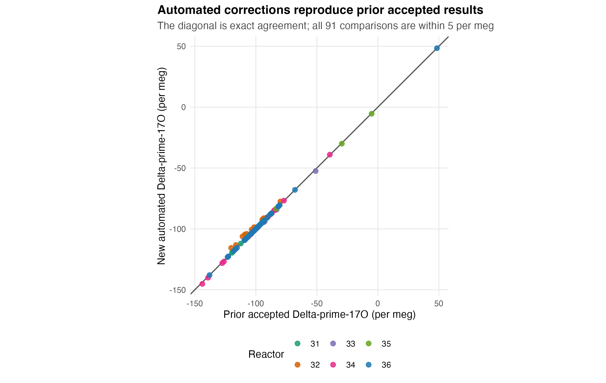
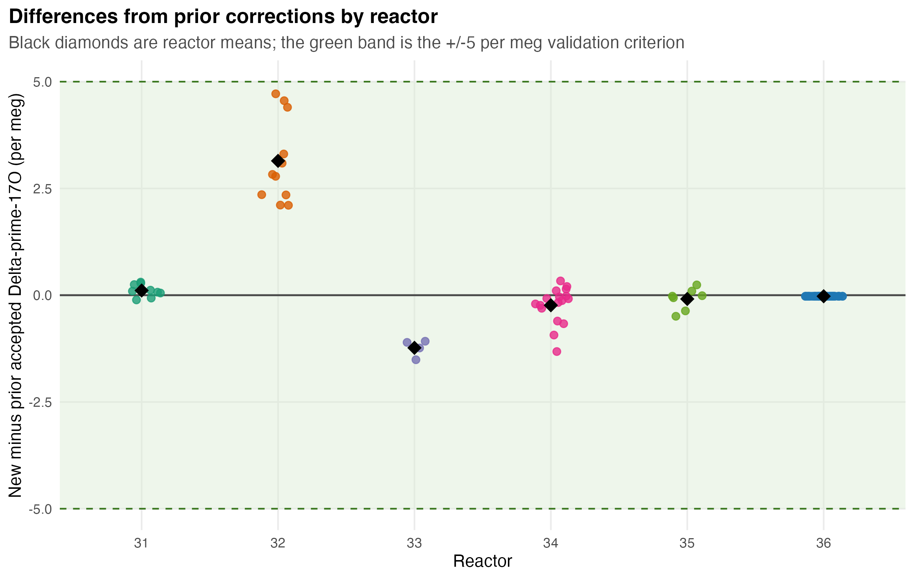
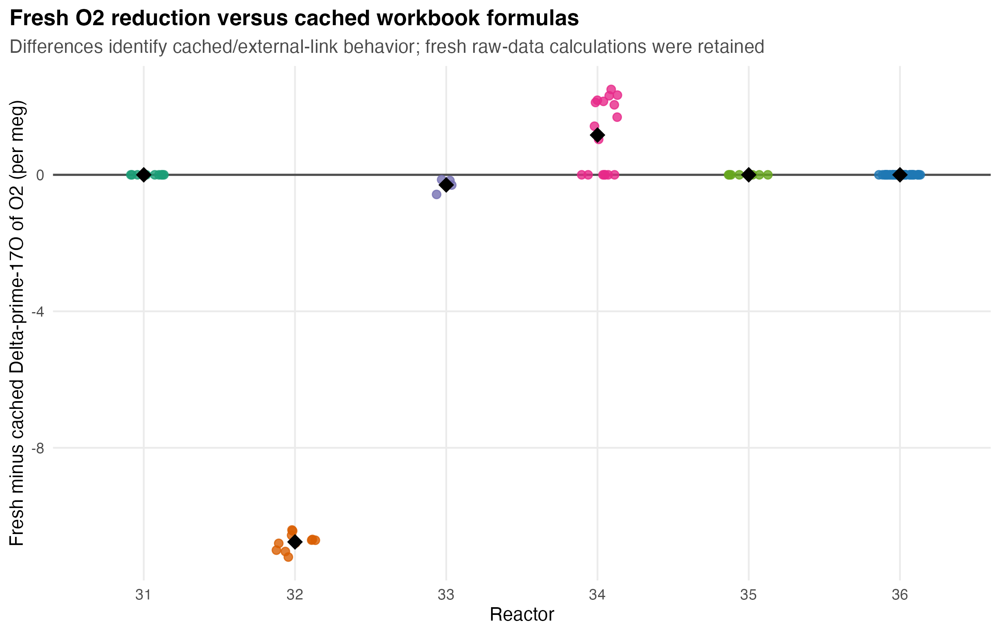

# IPL triple-oxygen isotope data correction procedure

**Project:** Paleogene Bighorn multiproxy reconstruction  
**Reactors:** IPL 31–36  
**Procedure implemented:** 12 August 2026  
**Correction program:** [`scripts/00_correct_IPL_triple_oxygen_reactors.R`](../scripts/00_correct_IPL_triple_oxygen_reactors.R)  
**Figure program:** [`scripts/00_plot_IPL17O_correction_validation.R`](../scripts/00_plot_IPL17O_correction_validation.R)

## Purpose and status

This document records exactly how the IPL carbonate triple-oxygen isotope data are reduced from the raw reactor spreadsheets to corrected carbonate values. It also records how Matthew Allen and OpenAI Codex reconstructed, automated, and validated the procedure.

The program processes reactors 31–36, compiles 91 project analyses, and writes a table with the same columns and column order as `data/raw/all_data_PgBHB_IPL17O_standardized_columns.csv`. All 91 automated values agree with the available prior accepted correction within **5 per meg**. This threshold is a reproducibility check against the earlier implementations; it is not an analytical uncertainty estimate.

## Inputs and outputs

### Raw analytical inputs

The program reads the `All Data` and `SMOW` worksheets in the six compiled IPL reactor workbooks:

1. `Cap17O Compiled REACTOR THIRTY ONE.xlsx`
2. `Cap17O Compiled REACTOR THIRTY TWO.xlsx`
3. `Cap17O Compiled REACTOR THIRTY THREE.xlsx`
4. `Cap17O Compiled REACTOR THIRTY FOUR.xlsx`
5. `Cap17O Compiled REACTOR THIRTY FIVE.xlsx`
6. `Cap17O Compiled REACTOR THIRTY SIX_7-19-26.xlsx`

The compiled reactor 33 workbook omits sample analyses IPL 5780–5783. Therefore, the program reads reactor 33 raw analyses from `R33_DataCorrection.xlsx`, while retaining the reactor 33 compiled workbook as the source of the SMOW–SLAP calibration constants.

The workbooks are read-only inputs. The program does not alter them.

### Historical comparison inputs

Two existing project tables are used only for identifiers and validation:

- `data/raw/all_data_PgBHB_IPL17O_standardized_columns.csv` supplies the historical output schema and the MLA sample/horizon identifiers associated with each IPL number.
- `data/raw/all_data_PgBHB_IPL17O_CODEX_AUTOMATED_CORRECTIONS.csv` supplies earlier manual, IPL-pipeline, and accepted values for reconciliation.

These historical results do **not** enter the calculation of the new correction.

### Outputs

The correction program writes:

- `data/processed/IPL17O_all_reactors_automated_standardized.csv` — corrected project dataset in the historical schema.
- `data/processed/IPL17O_automated_reconciliation.csv` — analysis-level comparison with prior results.
- `data/processed/IPL17O_automated_reconciliation_summary.csv` — reactor-level validation statistics.
- `data/processed/IPL17O_reactor_calibration_summary.csv` — SMOW–SLAP and gas δ′18O calibration parameters.
- `data/processed/IPL17O_standard_offset_summary.csv` — results and offsets for each carbonate standard.

## Notation and constants

The program distinguishes conventional delta values from logarithmic delta-prime values:

```text
δ′ = 1000 × ln(1 + δ/1000)
```

Capital delta-prime-17O is calculated in per meg:

```text
Δ′17O = 1000 × (δ′17O − λ × δ′18O)
```

The implemented constants are:

| Quantity | Value | Role |
|---|---:|---|
| λ | 0.528 | Reference slope used for Δ′17O and preservation of gas Δ′17O during δ′18O correction |
| α18, mineral/O2 | 0.9918723 | O2-to-carbonate δ18O fractionation factor recorded in the BP-validated workbook |
| θ, mineral/O2 | 0.5224019071720026 | Exponent used to calculate α17 |
| α17, mineral/O2 | α18^θ | O2-to-carbonate δ17O fractionation factor |
| 102-GC-AZ01 δ′18O gas | 23.91 per mil | Accepted gas value for δ′18O calibration |
| IAEA-C1 δ′18O gas | 36.30 per mil | Accepted gas value for δ′18O calibration |
| 102-GC-AZ01 Δ′17O mineral | −67 per meg | Accepted value for the final standard offset |
| IAEA-C1 Δ′17O mineral | −100 per meg | Accepted value for the final standard offset |

The mineral/O2 constants and the standard treatment were recovered from `R34_DataCorrection_bp_validated.xlsx`, which was treated as the authoritative worked example of the manual correction.

## Correction procedure

### Step 1 — Read and standardize each reactor workbook

For each reactor, the program reads all analysis-level isotope and quality-control columns from `All Data`. Minor header differences among workbooks are normalized. Rows lacking an IPL number or finite mass-33/mass-34 values are excluded from isotope reduction.

The following are carried through to the final dataset without being used to force the correction: raw isotope values and errors, capillary measurements, mass-33 through mass-36 values and errors, mismatch statistics, comments, and analysis flags.

### Step 2 — Recover the measured SMOW baseline and SMOW–SLAP slopes

The program reads the reactor-specific constants from fixed cells in the `SMOW` worksheet:

| Workbook cell | Value |
|---|---|
| Z4 | Measured SMOW mass-33 baseline |
| AA4 | Measured SMOW mass-34 baseline |
| AN6 | Zero-intercept SLAP transfer slope for δ17O |
| AN12 | Zero-intercept SLAP transfer slope for δ18O |
| AN14 | Workbook λ value, normally 0.528 |

For each analysis, measured mass-33 and mass-34 values are first referenced to the measured SMOW baseline:

```text
δ17O_SMOW = 1000 × [(1 + d33/1000)/(1 + SMOW_d33/1000) − 1]
δ18O_SMOW = 1000 × [(1 + d34/1000)/(1 + SMOW_d34/1000) − 1]
```

They are then placed on the SMOW–SLAP scale:

```text
δ17O_SMOWSLAP = δ17O_SMOW × slope17
δ18O_SMOWSLAP = δ18O_SMOW × slope18
```

### Step 3 — Convert the normalized O2 values to logarithmic notation

```text
δ′17O_O2 = 1000 × ln(1 + δ17O_SMOWSLAP/1000)
δ′18O_O2 = 1000 × ln(1 + δ18O_SMOWSLAP/1000)
```

The uncorrected oxygen-gas anomaly is then:

```text
Δ′17O_O2 = 1000 × (δ′17O_O2 − λworkbook × δ′18O_O2)
```

### Step 4 — Select valid carbonate standards

Standard names are converted to uppercase and stripped of punctuation so spelling and separator differences do not affect matching. A standard analysis is calibration-eligible only when:

- it matches 102-GC-AZ01 or IAEA-C1;
- `flag.major` is zero or missing;
- `flag.analysis` is zero or missing; and
- its normalized δ′18O value is finite.

The number of accepted analyses of each standard is written to the calibration summary.

### Step 5 — Correct oxygen-gas δ′18O using the carbonate standards

For reactors containing both standards, the program fits:

```text
known δ′18O_gas = intercept + slope × measured δ′18O_gas
```

Each standard material is given equal total weight. Thus, a reactor with many more IAEA-C1 analyses than 102-GC-AZ01 does not allow IAEA-C1 to dominate the transfer function merely because it has more replicates.

Reactor 31 contains IAEA-C1 but not 102-GC-AZ01. A two-point slope cannot be determined from one material. Reactor 31 therefore retains a slope of 1 and applies an intercept equal to the mean difference between measured and accepted IAEA-C1 δ′18O. This limitation is explicitly labeled `one-standard intercept-only transfer` in the calibration output.

### Step 6 — Preserve gas Δ′17O while applying the δ′18O correction

Changing δ′18O alone would change Δ′17O artificially. The program therefore applies the corresponding change to δ′17O along the λ = 0.528 reference line:

```text
δ′18O_correction = corrected δ′18O_O2 − measured δ′18O_O2

corrected δ′17O_O2 = measured δ′17O_O2
                      + 0.528 × δ′18O_correction
```

This changes the absolute gas isotope composition while preserving its measured Δ′17O.

### Step 7 — Convert corrected O2 to carbonate mineral values

The corrected logarithmic gas values are converted back to conventional delta notation:

```text
δ17O_O2 = 1000 × [exp(δ′17O_O2/1000) − 1]
δ18O_O2 = 1000 × [exp(δ′18O_O2/1000) − 1]
```

The gas values are then converted to carbonate mineral values:

```text
δ17O_carb = (1000 + δ17O_O2) × α17 − 1000
δ18O_carb = (1000 + δ18O_O2) × α18 − 1000
```

After reconversion to logarithmic notation, the pre-offset mineral anomaly is:

```text
Δ′17O_carb,pre = 1000 × (δ′17O_carb − 0.528 × δ′18O_carb)
```

### Step 8 — Apply the reactor-level mineral standard offset

For each standard material, the program calculates:

```text
standard offset = accepted Δ′17O_mineral
                  − mean measured Δ′17O_carb,pre
```

When both standards are present, their two offsets are averaged with equal weight. The final correction is:

```text
final Δ′17O_carb = Δ′17O_carb,pre + reactor standard offset
```

Equal standard-material weighting makes the result independent of unequal replicate counts and is internally consistent with the weighting used for the δ′18O calibration.

### Step 9 — Join project identifiers and enforce the historical schema

Corrected analyses are joined to `MLA_sample_id` and `MLA_horizon_id` using `IPL_num`. Only project analyses present in the historical identifier table enter the standardized output. The program then selects the historical columns in their exact original order and records `final_correction? = TRUE` whenever the final correction is finite.

### Step 10 — Reconcile against previous corrections

Each new value is compared with the previously accepted value associated with that IPL analysis. The comparison sources are:

| Reactor | Main prior comparison |
|---:|---|
| 31 | IPL R pipeline |
| 32 | IPL R pipeline |
| 33 | Manual Excel correction |
| 34 | BP-validated manual Excel correction |
| 35 | Prior compiled result; no independent manual correction located |
| 36 | Prior compiled result; no independent manual correction located |

The reconciliation table retains the new result, prior accepted result, any available manual result, previous automated result, signed difference, absolute difference, and calibration parameters.

## Validation results

### Agreement with previous accepted results



All 91 analysis-level comparisons fall within 5 per meg. The reactor-level results are:

| Reactor | n | Mean difference | RMSE | Maximum absolute difference | Within 5 per meg |
|---:|---:|---:|---:|---:|---:|
| 31 | 9 | +0.110 | 0.177 | 0.306 | 9/9 |
| 32 | 11 | +3.145 | 3.283 | 4.716 | 11/11 |
| 33 | 4 | −1.233 | 1.244 | 1.511 | 4/4 |
| 34 | 17 | −0.236 | 0.477 | 1.319 | 17/17 |
| 35 | 7 | −0.088 | 0.254 | 0.493 | 7/7 |
| 36 | 43 | −0.025 | 0.025 | 0.025 | 43/43 |



Reactor 32 has the largest systematic difference from the earlier IPL pipeline, but every reactor 32 analysis remains inside the predefined 5 per meg reproducibility criterion. The close agreement of reactor 34 with the BP-validated manual workbook is the most direct check that the reconstructed sequence reproduces the intended manual procedure.

### Fresh calculations versus cached workbook formulas



Some compiled workbooks contain formulas linked to external workbooks. Spreadsheet readers can recover the last cached result of those formulas but cannot guarantee that the cache reflects the current raw data and calibration cells. The fresh O2 calculation differs from the cached formula result by as much as 11.202 per meg, principally in the affected reactors.

The automated program deliberately recalculates O2 values from the raw mass-33/mass-34 measurements and the calibration constants rather than adopting opaque cached formula outputs. The cached differences are retained in `workbook_O2_difference` for audit purposes. Their presence is not evidence that the final correction failed: the final independently calculated carbonate results still reconcile with all prior accepted values within 5 per meg.

## How Matthew Allen and Codex developed the programs

The programs were developed collaboratively and iteratively rather than inferred from a single formula sheet.

### 1. Matthew defined the scientific and archival problem

Matthew assembled the raw reactor spreadsheets, existing project CSVs, manual correction files, and the BP-validated workbook. He identified the need to lock the triple-oxygen dataset, understand exactly what the earlier IPL automation had done, determine whether reactor 36 had been manually corrected, and verify that copies of the raw reactor datasets existed. He then requested one reproducible program that would apply the correction to every reactor and check the result against both manual and IPL-pipeline corrections.

### 2. We treated the previous corrections as evidence, not as unquestioned inputs

Together, the existing products were separated into three roles:

- **Raw analytical evidence:** reactor `All Data` and `SMOW` sheets.
- **Method evidence:** manual correction workbooks, especially `R34_DataCorrection_bp_validated.xlsx`.
- **Validation evidence:** earlier IPL-pipeline, manual, and accepted project values.

This separation was important: the historical corrected values were used to test the new program, but never to calculate its new corrected values.

### 3. Codex reconstructed the manual calculation cell by cell

Codex traced the BP-validated workbook from measured SMOW and SLAP corrections through logarithmic notation, gas δ′18O adjustment, preservation of Δ′17O, mineral conversion, and standard residual correction. Constants and accepted standard values were transcribed into named variables rather than left as spreadsheet cell references.

The other reactor workbooks and correction files were then cross-checked to identify consistent steps, header differences, missing analyses, and formulas that depended on external workbook links.

### 4. We resolved ambiguities explicitly

Several choices could not safely remain implicit:

- Reactor 33's compiled workbook was incomplete, so its complete correction workbook was used for the raw analysis rows.
- Reactor 31 had only one of the two carbonate standard materials, so it received a unit-slope, intercept-only δ′18O transfer rather than an unjustified two-point regression.
- Standard materials were given equal total weight so unequal replicate counts would not silently control the correction.
- Fresh calculations were retained when cached external-link spreadsheet formulas disagreed.
- A 5 per meg difference from prior accepted values was adopted as a strict implementation-reproducibility flag, not as a statement of measurement precision.

These decisions are recorded in code comments and output fields so future revisions can be evaluated rather than guessed.

### 5. Codex implemented a single reactor function and applied it uniformly

The final R program uses one correction function for all six reactors. Reactor-specific behavior is limited to source-file configuration and the scientifically necessary one-standard fallback. This avoids maintaining six subtly different correction paths.

The program also produces audit tables at the same time as the corrected dataset. The validation is therefore part of the workflow, not a separate informal inspection.

### 6. We tested structure, completeness, and numerical agreement

The completed run was checked for:

- exact agreement with the 31-column historical CSV schema;
- 91 output analyses;
- unique IPL numbers;
- finite corrected values and `final_correction? = TRUE` for all analyses; and
- agreement within 5 per meg for every comparison with a prior accepted result.

The program was then run in the project to create the committed-style processed products and the validation figures shown here. Existing unrelated changes in the R project were left untouched.

## Reproducing the correction and figures

From the project root, run:

```r
source("scripts/00_correct_IPL_triple_oxygen_reactors.R")
source("scripts/00_plot_IPL17O_correction_validation.R")
```

The default raw-workbook path can be overridden without editing the program:

```r
Sys.setenv(IPL17O_REACTOR_DIR = "/path/to/reactor/workbooks")
Sys.setenv(IPL17O_OUTPUT_DIR = "/path/to/output")
source("scripts/00_correct_IPL_triple_oxygen_reactors.R")
```

The scripts require `dplyr`, `ggplot2`, `here`, `readr`, `readxl`, `stringr`, and `tidyr`.

## Interpretation and limitations

1. The new program reproduces the previous correction systems closely, but reproducibility does not independently establish the accepted standard values or fractionation constants. If those reference values change, they should be updated deliberately and the complete reconciliation rerun.
2. Reactor 31's δ′18O transfer is constrained by only one standard material and is therefore less strongly determined than the two-standard reactors.
3. Reactors 35 and 36 lack an independent manual correction in the reviewed files. Their comparisons demonstrate consistency with prior compiled results, not independent replication of a separate manual calculation.
4. The 5 per meg criterion validates implementation consistency. Analytical acceptance should also consider mismatch statistics, flags, standard reproducibility, replicate dispersion, and sample-level geological screening.
5. The source workbook paths currently reflect Matthew's local OneDrive organization. Environment variables are provided to make the workflow portable.

## Audit trail

The analysis-level reconciliation CSV is the primary audit trail. For any questioned analysis, locate its `IPL_num` and inspect:

- `new_automated`;
- `legacy_standardized`, `legacy_manual`, and `previous_automated`;
- `new_minus_legacy` and `within_5_permeg`;
- `workbook_O2_difference`; and
- the reactor calibration method, slope, intercept, and standard offset.

This makes every final value traceable to a raw analysis, a documented correction path, and an explicit comparison with the prior project record.
